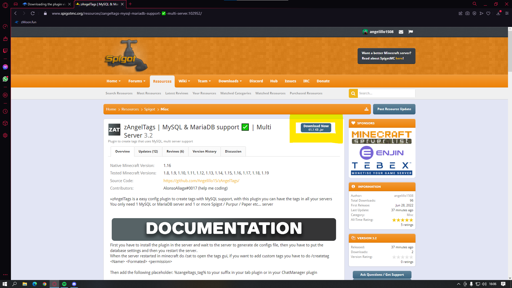

# Downloading the plugin via SpigotMC

To download zAngelTags, you just need to [click here](https://www.spigotmc.org/resources/zangeltags-mysql-mariadb-support-%E2%9C%85-multi-server.102952/), and you will be redirected to my SpigotMC page. Something similar to this will appear:

